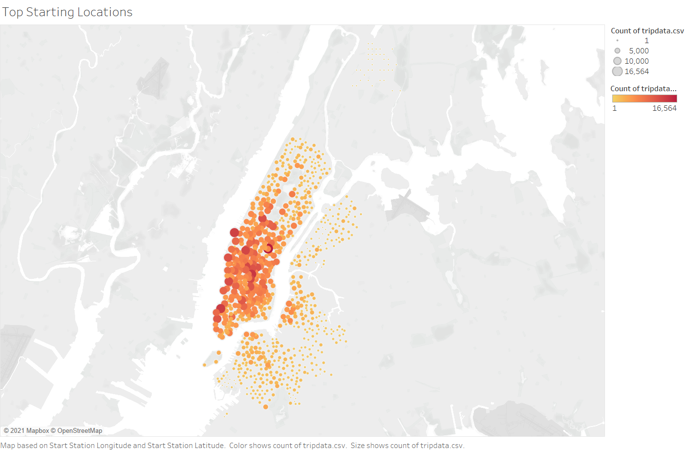
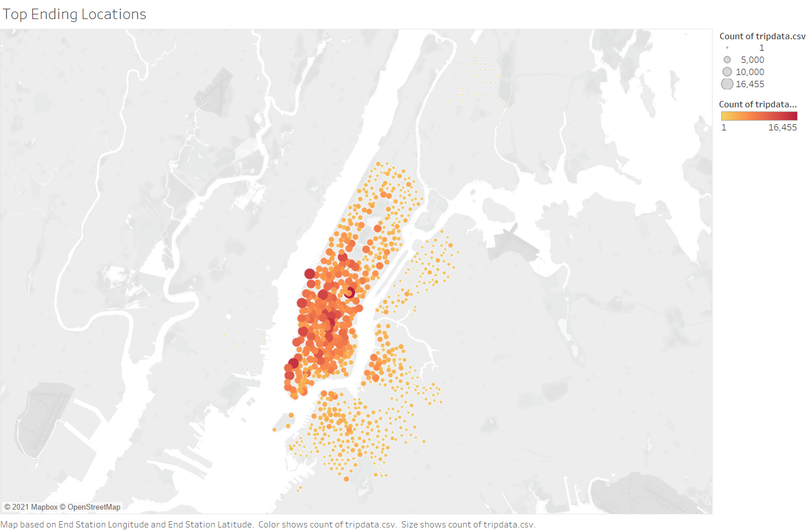
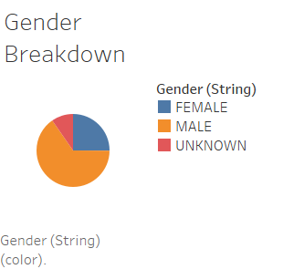
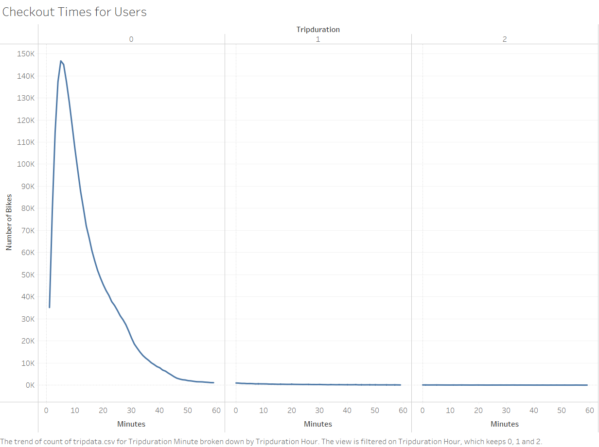
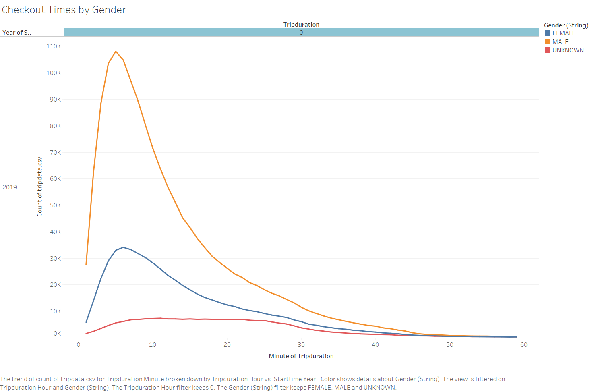
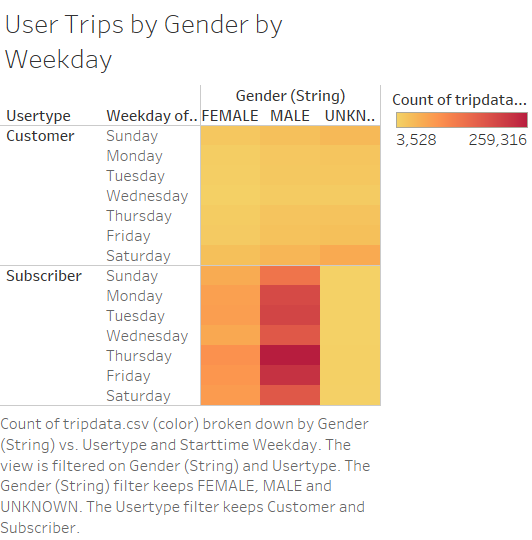
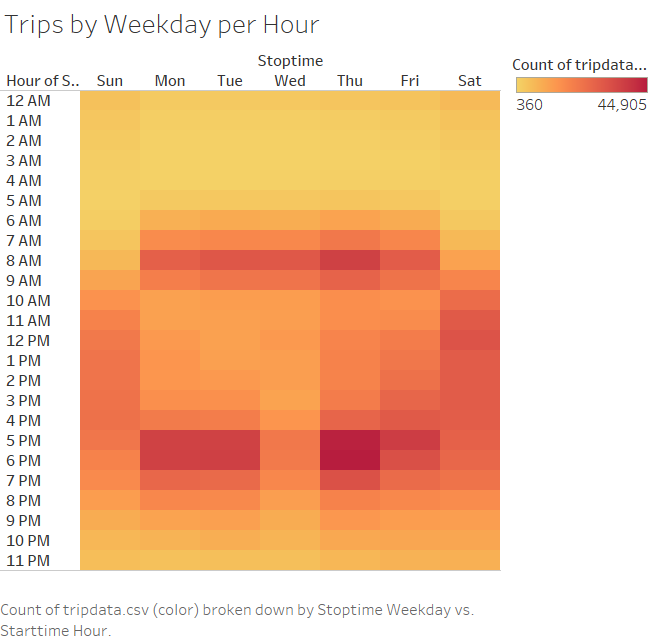
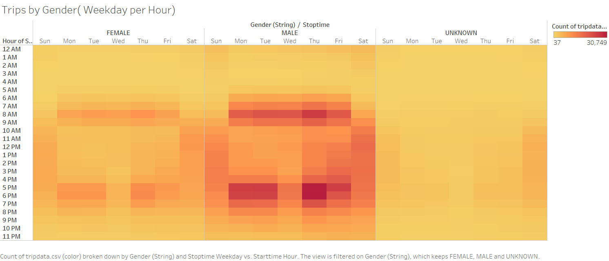

# Overview
Our intention is to start a bike-share program for the town of Des Moines,  Iowa. A potential angel investor surfaces for whom we need to create a proposal for using data from the bike-share business in New York City. This analysis will be visualized using Tableau. 

# Results
## Top Starting Locations
Analysis of the usage of bike stations for users starting their trips across New York was performed to identify the most popular starting locations within the bike-share program. Trips are visualized as circular markers along with the map (shown below), whose size and colour represent the number of trips counted. It is apparent to see that Manhattan has the most bike activity.

## Top Ending Locations
As you can see below, the spread of usage across New York regarding stations where users ended their trips looks very similar to that of the starting locations. Manhattan remains popular, especially within the city center and along the water's edge. 

## Gender Breakdown 
The sample was broken down by gender and shown to be predominantly male, with a small portion of users not disclosing their gender, as seen below. 

## Trip Duration
Within the sample, trips very rarely fell over an hour in duration, with the vast majority remaining under 30 minutes long. 

This trend remains consistent when broken down by gender despite the lower numbers of trips amongst non-male riders. Most trips fell around 5 to 15 minutes long. These findings suggest that bikes are being used for transportation as opposed to leisure.

## User Trips by Gender by Weekday

When looking at weekdays as a whole, this provides a broad overview of usage across the week and shows higher activity between Monday and Friday typically, except for Wednesday. This suggests that transportation usage is likely for users on their commute to and from work; this does not vary across gender. To better understand this trend, we will break down the usage by hour throughout each day. 

## Trips by Weekday per Hour

The heatmap below shows that usage on weekends remains spread out across the day (typically falling between 9 am - 7 pm), while activity from Monday to Friday clusters in high activity periods at the beginning and end of each workday (around 7-9 pm and 5-7 pm). 

These findings bolster our theory that users typically rely on the program for transportation, namely to and from work throughout the week. There is a slight deviation from this pattern in the dip in usage on Wednesday evenings compared to the rest of the workweek.

When broken down by gender, these findings remain consistent.

# Summary
In summary, the bike share program in New York seems to predominantly service commuters in Manhattan throughout the workweek, with most trips lasting no longer than half an hour. Users were primarily male; however, trends in ride duration and usage throughout the week did not vary notably between men, women and those who did not disclose their gender. 

In order to better understand the typical user of this service, further analysis would do well to map out each start and stop station id to visualize the common routes. It would also be helpful to look at differences in usage across age to determine if users are predominantly working adults or perhaps students. A breakdown of age by gender could provide us with a better snapshot of the typical user of the bike-share program that may be compared with Des Moines population data to assess the viability of this service in our market. 